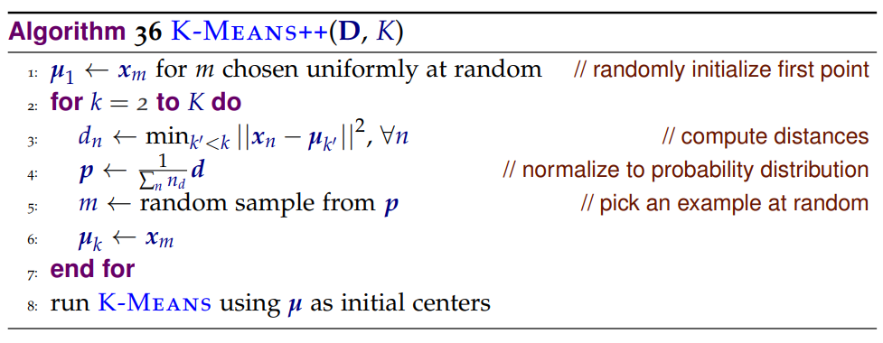
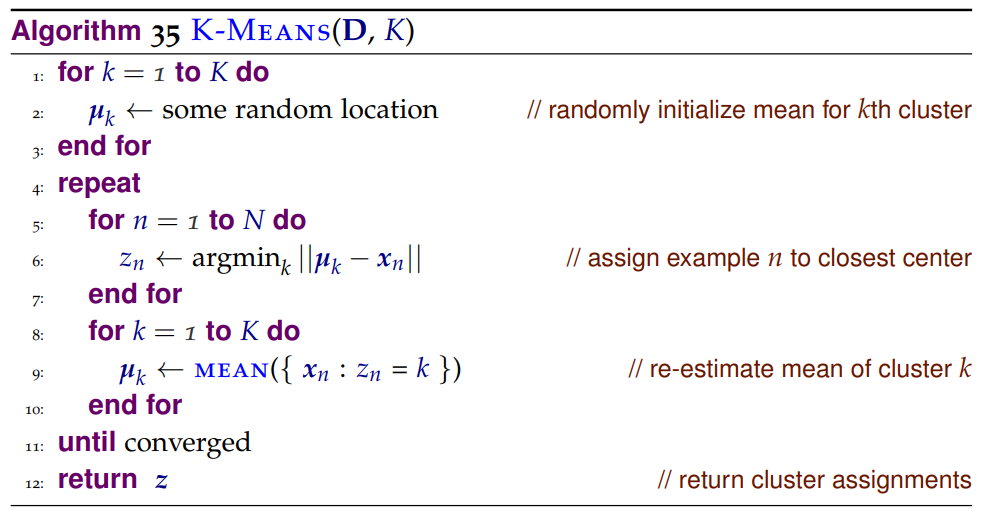

# kompression

This website uses the K-Means++ Algorithm to quantize an image and returns a compressed version with k colors.

## Algorithm

The algorithm used is from chapter 15 from "A Course in Machine Learning" by Hal Daumé III as shown below

A slight modification is made to the Standard K-Means Algorithm, where we iterate only a set number of times, not until convergence.
